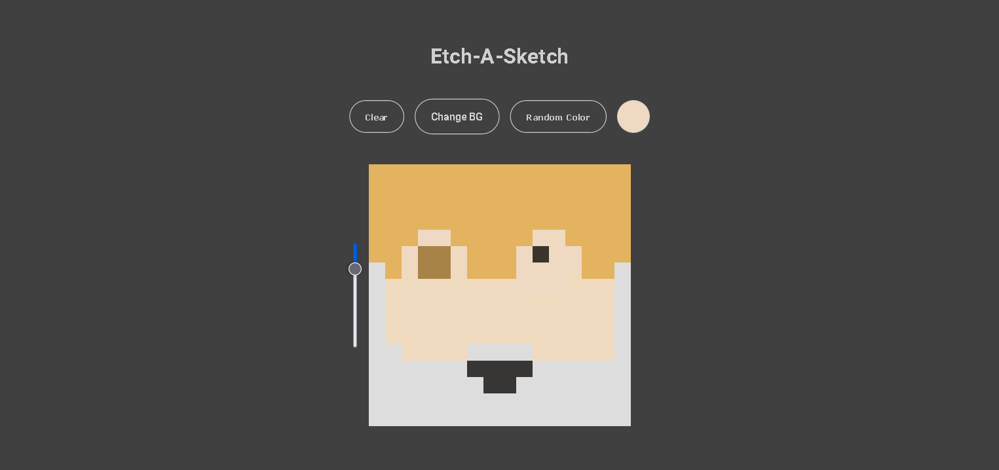

# Etch-A-Sketch

An Etch-A-Sketch Project made with Basic HTML, CSS, and Javscript for The Odin Project Foundations Path

I made it very simple. You are able to choose the grid's background color and
you can choose between rainbow color or normal color. To start drawing you have to click on the grid container and click again to stop.

If you have suggestions please tell it to me on discord nevz#9704

### Preview

### Links

- The Odin Project: [https://www.theodinproject.com/](https://www.theodinproject.com/)

- Live Demo: [https://nevz9.github.io/etch-a-sketch/](https://nevz9.github.io/etch-a-sketch/)

### Built with

- Basic HTML5 and CSS3
- Basic Javascript DOM Manipulation

